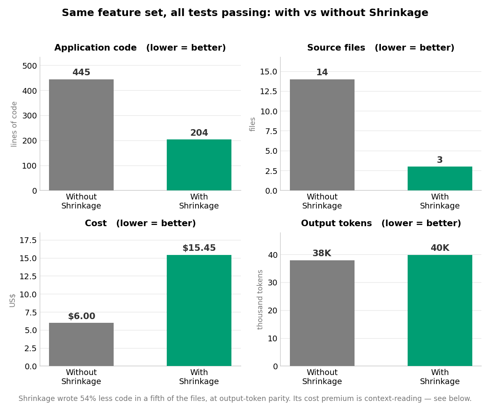
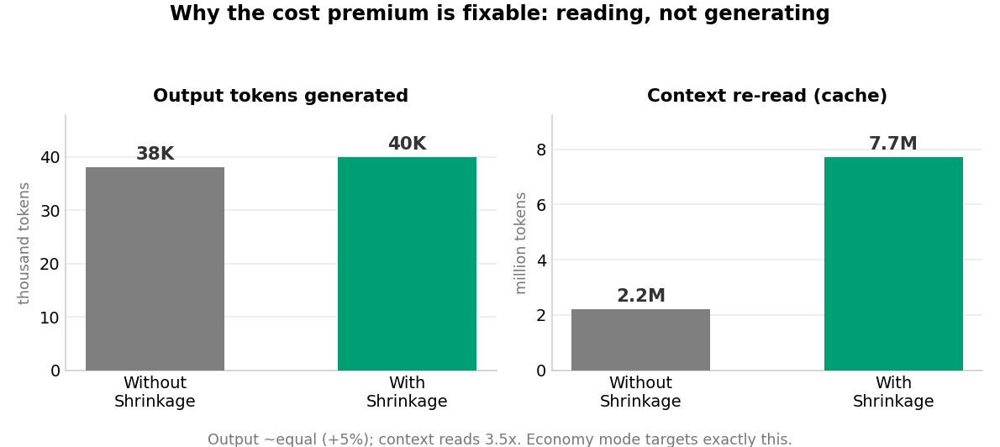

# Shrinkage

> Normally, shrinkage is a bad thing — the word you deploy with an explanation
> attached. *"I was in the pool!"* Not here. Here, shrinkage is the whole point.

**Shrinkage is a Claude Code / Copilot plugin that makes your AI write less, and
better, code — and safely delete the code you no longer need.** It gives the
model a token-lean map of your codebase, a discipline that extends what exists
instead of piling on new files, and a safety-gated way to shrink existing
projects without breaking them.

The devs you brag about aren't the ones who wrote the most code. They're the ones
who shipped the feature and the diff came out **negative**. Shrinkage makes your
agent one of those devs.

---

## What it does

- **Maps your repo cheaply.** A script parses your code (Python, JS/TS, PHP, Go,
  Rust, Java, C#, Kotlin — plus Blade/.phtml/Twig/Vue templates, Android
  manifest/layout XML + ProGuard rules, with reference-only
  indexing for Handlebars/Jinja/Smarty/ERB and framework XML/YAML config) into
  a compact symbol map — the agent reads ~4k tokens of map
  instead of grepping half the repo to rediscover what already exists.
- **Writes less as you go.** Before new code is written, a *reuse gate* makes the
  agent extend an existing function/class instead of adding a parallel one —
  following an explicit ladder (change a value → add a parameter → extend a
  method → … → new file, justified).
- **Shrinks existing projects safely.** An audit finds dead code, duplication,
  and speculative structure; a shave removes it — one atomic, revertible commit
  per change, with an evidence chain and a green-test gate, so **backwards
  compatibility is never broken**.
- **Keeps score.** After every change it reports net lines (app vs test,
  separately), new/removed symbols, and a trend over time. Negative is the high
  score.
- **Costs less to run** (economy mode): the cheap model does the mechanical
  lift-and-shift; the capable model is reserved for deciding *what* to change.

---

## Get started (30 seconds, then never again)

In Claude Code:

```
/plugin marketplace add parkktech/shrinkage
/plugin install shrinkage@parkktech
```

**That's the whole setup.** From your next session, Shrinkage runs itself in
every repo:

- The codemap builds automatically when a session opens, and every session
  shows one status line — `[shrinkage] active · N symbols · run /srk:audit`,
  which becomes your open SHRINK-PLAN item count and est. LOC-to-reclaim once
  you've audited.
- Coding tasks are guided automatically — extend-don't-add, scored diffs.
- Type `/srk:` anytime to drive manually (the commands are listed below).

Nothing to configure, nothing to run per-repo.

<details>
<summary><b>Optional extras</b> (skip these unless you want them)</summary>

- `/srk:onboard` — set preferences: strict gate, team-shared map, humor off.
- `/srk:update` — reliable update: checks version, clears the stale plugin
  cache, hands you the two reinstall lines (fixes "update available but won't
  apply").
- Live status under the input box (`srk ▼-123 LOC · streak 3`): run
  `/statusline` and point it at `skills/shrinkage/scripts/statusline.py`.
- Exact parsing (regex fallback already works):
  `pip install tree-sitter tree-sitter-javascript tree-sitter-typescript tree-sitter-php`
- GitHub Copilot instead of Claude Code: see [Other runtimes](#other-runtimes).

</details>

## Updating

```
/srk:update
```

Checks your installed version against the latest and prints the update steps.

**Best: turn on auto-update once.** `/plugin` → **Marketplaces** → `parkktech` →
**Enable auto-update** (third-party marketplaces ship with it off). Claude Code
then updates the plugin in the background after startup and prompts
`/reload-plugins` — no manual dance, new releases just arrive.

To update by hand, the reliable path is **uninstall → install → relaunch**:

```
/plugin uninstall shrinkage@parkktech
/plugin install shrinkage@parkktech
```

…then quit and relaunch. The `uninstall` clears the pinned cache **and** the
registration together — that's the bit that matters. Don't just delete the
cache folder: that leaves the plugin registered but file-less, and Claude Code
then reports `already installed` + `cache-miss` (a loop `/plugin install` can't
break). Only if the marketplace *clone* is corrupted, with Claude Code closed:
`rm -rf ~/.claude/plugins/marketplaces/parkktech ~/.claude/plugins/cache/parkktech`,
then reopen, `/plugin marketplace add parkktech/shrinkage`, and reinstall.

## Composer frameworks: Laravel, Magento 2, Drupal

Framework apps are where reuse pays biggest — the platform already has most of
what you're about to write. Shrinkage reads **Composer's own class index**
(`vendor/composer/autoload_classmap.php` — no vendor parsing, instant even on
a 60k-class Magento install), detects your framework from `composer.json`, and:

- **`/srk:query` + `codemap.py vendor <term>`** — before writing anything, the
  gate sweeps vendor: "does Illuminate/Magento/Drupal core already provide
  this?" Calling code you don't own is the ultimate shrink.
- **Framework-aware extension ladder** — dedicated rules map changes onto each
  framework's sanctioned seams: Laravel macros, listeners, FormRequests;
  Magento plugins, observers, view models (di.xml preferences last, with
  justification); Drupal alter hooks, service decoration, plugins. Core is
  never edited; parallel classes are never the reflex.
- **Framework-safe deletion** — the dynamic-reference checklists cover each
  ecosystem's string-reference graph (di.xml/layout XML, services.yml/routing
  YAML, hooks-by-naming-convention, generated factories, queued job class
  names), so "zero references" can't fool the shave where frameworks hide them.

## Reduce code size in an existing project

This is Shrinkage's home turf. Three steps:

**1. Map it.** In your repo:
```
/srk:map
```
Builds the symbol map and reports what languages it found. On a large repo this
is where the agent stops re-reading everything and starts working from the index.

**2. Audit it.** 
```
/srk:audit
```
Runs six read-only evidence sweeps — dead symbols, duplication (same-name **and**
renamed copy-paste), single-implementer abstractions, expired feature flags,
hand-rolled code the platform already provides, and comment/zombie noise — and
writes a ranked **`SHRINK-PLAN.md`**: every candidate with a catalog tag, a risk
tier, an evidence chain, and an estimated line saving. It finds and ranks; it
does **not** cut. Safe to run anytime.

**3. Shave it.** Point it at what to clean — a plan item, a folder, or a file:
```
/srk:shave 1                  # item #1 from SHRINK-PLAN.md, then prompts for the next
/srk:shave --auto             # work the WHOLE backlog until it needs you
/srk:shave --auto --dangerous # full send: execute T2/public-surface items too
/srk:shave --full-send        # alias for --auto --dangerous
/srk:shave src/billing        # sweep one folder
/srk:shave src/Invoice.php    # sweep one file
/srk:shave                    # no target: the files in your current diff
/srk:shave 1 --dry-run        # show the full plan for item 1, change nothing
```
Each removal is its own commit with tests green before and after — reverting
instantly if anything breaks. Three ways to work the backlog:

- **Step through it** — a single `/srk:shave N` ends by naming the next item,
  so you review one commit at a time.
- **`--auto`** — runs the backlog top-to-bottom unattended, one tested atomic
  commit per item, and stops at the first thing needing your judgment (a
  T2/public-surface change), a red gate, or an empty plan. When it stops it
  reports what got done and your options — a drained T0/T1 backlog is "safe
  work complete," not a failure. It's **context-durable**: each item runs in a
  fresh subagent, so a long run finishes in one session and survives a `/clear`
  — no manual clearing needed.
- **`--auto --dangerous`** (alias **`--full-send`**) — executes the
  human-judgment items too: direct removal of public surface, still one tested,
  atomic, revertible commit each, still hard-stopping on a red suite. The escape
  hatch —
  loud, opt-in, and off when a team sets `allow_dangerous: false`.

Then:
```
/srk:score        # confirm it came out net-negative
/srk:trend        # watch the codebase shrink over time
```

### The safety model (why it won't break your stuff)

Backwards compatibility outranks every reduction. Nothing on the **compatibility
surface** — public functions, endpoints, CLI flags, config keys, wire formats,
schemas — is ever removed directly; it changes additively or through a
deprecation cycle. Every deletion requires a five-link evidence chain (map refs →
repo-wide grep incl. configs/templates → the language's dynamic-reference
checklist → test evidence → git history) before a line is touched, and each
change is one revertible commit behind a green-test gate. A reduction that breaks
behavior isn't shrinkage — it's an amputation, and the model is instructed to
refuse it. Full detail: `skills/shrinkage/references/safety-model.md`.

---

## Write less as you go (new work)

```
/srk:gate "add CSV export to the reports page"
```
Before writing code, the gate pulls candidate symbols from the map, decides
*extend-or-justify* for each, and proposes the smallest diff on the extension
ladder — so new files are the justified exception, not the reflex. Then implement,
and `/srk:score` to grade the diff.

---

## Economy mode (lower cost)

Shrinkage tiers the work by model, so you pay flagship rates only for judgment:

| Role | Job | Model |
|------|-----|-------|
| **srk-auditor** | find *what* to reduce (+ evidence) | capable (`inherit`) |
| **srk-surgeon** | apply one decided transform (lift & shift) | **Haiku** (cheap) |
| **srk-verifier** | prove it didn't break anything | capable (`inherit`) |

The expensive model finds and verifies; the cheap model does the mechanical
edits, with the test gate — not the model — guaranteeing safety. To run
everything on the flagship model, set `model: inherit` in
`agents/srk:surgeon.md`; to push economy further, drop the auditor to a mid model
too.

---

## Benchmark: with vs without Shrinkage

Same crypto backtesting spec, built from scratch twice, all tests passing both
ways (full methodology in [`benchmarks/`](benchmarks/)).



**Shrinkage wrote 54% less application code (204 vs 445 lines) in a fifth of the
files (3 vs 14), at 99% test coverage** — the same working feature set, far less
of it. Its output-token count was within 5% of the un-tooled run; the cost
premium came entirely from *reading* context, not generating code:



That's exactly what **economy mode** targets. Note this was a *greenfield* build —
Shrinkage's weakest case (nothing to reuse or shave in an empty repo); its
reduction engine shines hardest on existing codebases, per the flow above.

---

## Commands

| Command | Does |
|---|---|
| `/srk:onboard` | one-shot setup: build the map, capture preferences |
| `/srk:map` | build/refresh the codemap, detect languages |
| `/srk:query <term>` | find existing symbols at map cost, not grep cost |
| `/srk:gate <task>` | reuse gate before writing code |
| `/srk:score [--pr] [--log]` | the scoreboard (app vs test LOC, symbols) |
| `/srk:trend` | cumulative code weight + shrink streak |
| `/srk:shave [N \| --auto [--dangerous] \| path]` | safe subtraction pass; `--auto` works the whole backlog, `--dangerous` full-sends |
| `/srk:audit [dir]` | ranked reduction backlog → `SHRINK-PLAN.md` |
| `/srk:config` | settings: gate, map policy, PR scoreboard, budget, comedy |
| `/srk:update` | check version + clear the stale plugin cache for a clean update |
| `/srk:help [command]` | every command in the order you'd use them |

---

## Settings

`.claude/shrinkage.json`, all optional:

```json
{
  "gate": "soft",
  "commit_map": false,
  "pr_scoreboard": false,
  "budget": 4000,
  "humor": true,
  "quiet_startup": false,
  "auto_max_items": 0,
  "auto_context_stop": 75,
  "allow_dangerous": true
}
```

- `gate: "hard"` — confirm before new files/modules.
- `commit_map: true` — share the map with the team instead of gitignoring it.
- `humor: false` — the tools stop cracking jokes.
- `quiet_startup: true` — suppress the session-start status line.
- `auto_max_items` — optional review cap for `/srk:shave --auto` (0 = run to completion).
- `auto_context_stop` — context-% fallback that pauses `--auto` (subagent dispatch usually keeps it from mattering).
- `allow_dangerous: false` — team kill-switch that refuses `/srk:shave --auto --dangerous`.

---

## Other runtimes

- **GitHub Copilot** — [`skills/shrinkage/adapters/copilot/`](skills/shrinkage/adapters/copilot/):
  repo-level instructions plus `.prompt.md` slash-command files for VS Code,
  Visual Studio, and JetBrains, and instructions the Copilot coding agent reads.
- **Anything with a shell** — the map and scoreboard are plain Python scripts;
  any agent that can run a command can use them.

---

## Growing to a new language

Two files, no core changes: a parser adapter in
`skills/shrinkage/scripts/parsers/<lang>.py` (brace languages reuse a shared
scanner — the PHP adapter is 40 lines) and a `rules/<lang>.md` with that
language's idioms and — critically — its dynamic-reference checklist, which is
what makes deletion safe in that ecosystem.

---

## FAQ

**Is a negative diff really the goal?** The goal is the feature. A negative diff
is the feature *plus* proof the agent understood the codebase well enough not to
duplicate it.

**My change came out +400 lines. Should I panic?** No — sometimes code has to
grow. The scoreboard doesn't forbid growth; it makes growth *cost something to
claim*. If the +400 survived the gate and the ladder justifications, own it.

**Can I say "shrinkage" in the sprint review?** You can, and someone will smile —
the correct amount of morale for one word.

---

*Shrinkage: because being a grower isn't always a good thing.*
