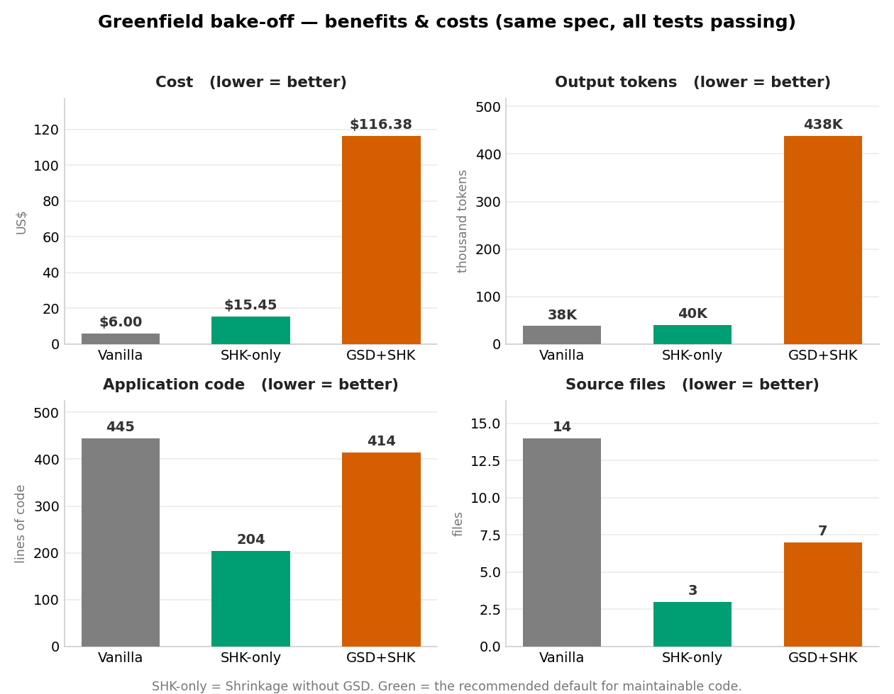
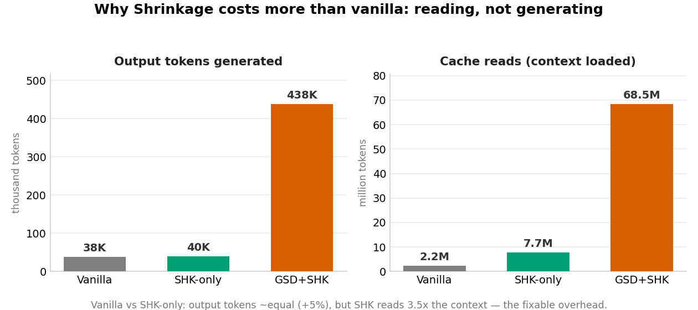

# Benchmark: Greenfield Crypto Strategy Finder & Backtester

A three-arm A/B/C bake-off. All arms built the **same** two-milestone spec
(SMA/RSI/Donchian strategies, backtest engine with 5 metrics + Sortino, grid
finder with selectable objective, walk-forward validation, CLI) from an
identical `SPEC.md`, on the same model, from an empty repo. All three passed
their acceptance tests. n=1 per arm — directional, not conclusive.

## Arms

- **A — GSD + Shrinkage** — full tooling: `/gsd-new-project` phase loop +
  `/srk-gate` before code, `/srk-score` after.
- **B — Vanilla** — plain Claude Code, no GSD, no Shrinkage.
- **C — Shrinkage only** — plain Claude Code + Shrinkage (`/srk-onboard`,
  `/srk-gate`, `/srk-score`), no GSD.

## Results

Code lines measured identically in every arm:
`git ls-files | grep -vE '\.planning/|\.md$' | xargs wc -l`.
Cost/tokens from Claude Code `/cost`.

| Measure | A · GSD+SHK | B · Vanilla | C · SHK-only |
|---|---|---|---|
| **Executable app statements** (coverage.py) | 158 | 238 | **108** |
| Tracked code lines | 994 | 754 | **372** |
| — app | 414 | 445 | **204** |
| — test | 564 | 306 | 156 |
| Source files | 7 | 14 | **3** |
| Planning docs (separate) | 3,764 | ~90 | ~60 |
| Tests passing | 21 ✓ | 33 ✓ | 14 ✓ |
| **Coverage** | 99% | 96% | **99%** |
| Output tokens | 438k | 38.0k | 39.9k |
| Cache reads | 68.5M | 2.2M | 7.7M |
| **Cost** | **$116.38** | **$6.00** | **$15.45** |
| Wall time | 2h25m | 12m | 26m |

*SHK-only (green) wrote the least code in the fewest files, at output-token
parity with vanilla, for a fraction of GSD+SHK's cost.*

*Shrinkage's premium over vanilla is context-reading (cache reads), not
generation (output tokens are within 5%) — which is why it's optimizable.*

## Findings

1. **Shrinkage-only produced the least code by a wide margin** — 204 app LOC
   in 3 files vs 445/14 (vanilla) and 414/7 (GSD+SHK), same feature set, all
   tests green. In Milestone 2 every feature landed as an extension (Donchian
   as a sibling strategy, Sortino inside `backtest()`, `objective=` as a
   defaulted finder parameter, walk-forward composing the existing finder) with
   **zero new files**. The extension ladder / anti-speculation doctrine works.

2. **Shrinkage's cost premium is context-reading, not extra generation.**
   Output tokens (39.9k) were within 5% of vanilla (38.0k) — the model didn't
   do more work, it *read* more (3.5× cache reads: the codemap, rules, and
   safety model). The ~$9 premium over vanilla is loading Shrinkage's own
   context, concentrated in the `/srk-gate` (8%) and `/srk-score` (3%)
   subagents. That overhead is optimizable (run inline, cheaper model for
   simple subagents).

3. **GSD, not Shrinkage, drove the 19× cost of arm A.** Same Shrinkage skill,
   no GSD → $15.45 vs $116.38 (7.5× cheaper) and 60 vs 3,764 lines of planning
   docs. GSD's multi-phase subagent planning (68.5M cache reads) is the cost.

## Decision framework

- **Quick / throwaway / tiny greenfield →** vanilla. Cheapest, works.
- **Real code you'll maintain →** Shrinkage, no GSD. Least code, ~2.6× vanilla
  cost, most of that premium optimizable.
- **Large / long-lived / correctness-critical codebase →** GSD + Shrinkage.
  Accept the cost for planning discipline and context-rot defense at scale.

## Caveats

- n=1 per arm. Model nondeterminism can swing a single run's LOC more than the
  tooling does — average 2–3 runs before betting a team decision on it.
- Coverage confirmed on all three arms: A 99%, B 96%, C 99% — every arm's
  misses are the same benign structural lines (`__main__` guards, an unreachable
  validation branch, the CSV fallback). Arm C's smaller test suite (14 tests,
  156 LOC) is more efficient, not thinner: it hit the highest coverage tier with
  the least test code. "Less code" is a clean win here, not "less testing."
- Greenfield understates GSD (built for large existing/long-lived work) and is
  the weakest case for Shrinkage's reuse/dead-code engine (nothing to reuse in
  an empty repo). A brownfield feature-add on a messy existing repo is the
  fairer test of both tools' actual purpose — not yet run.
